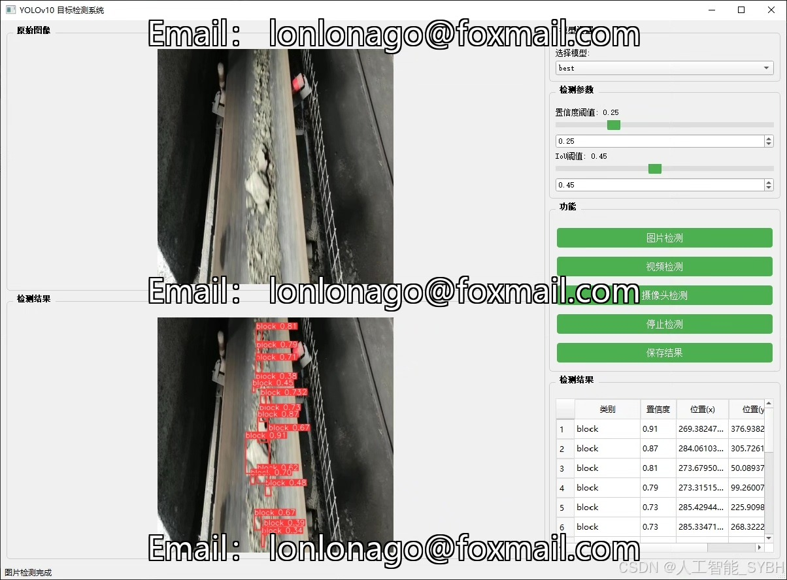
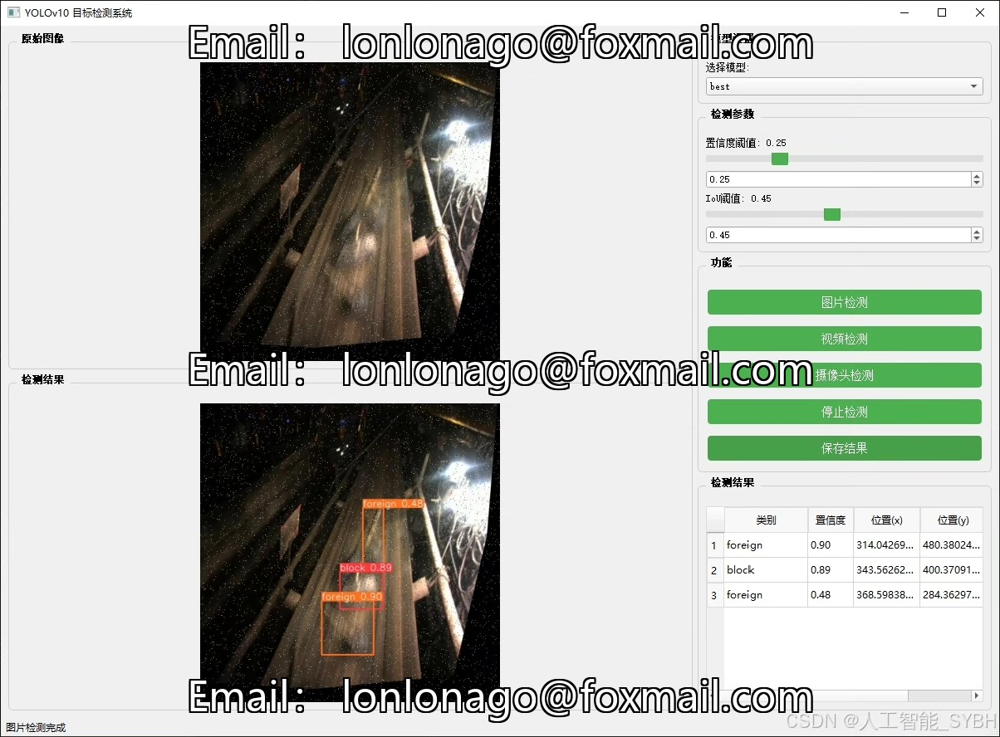
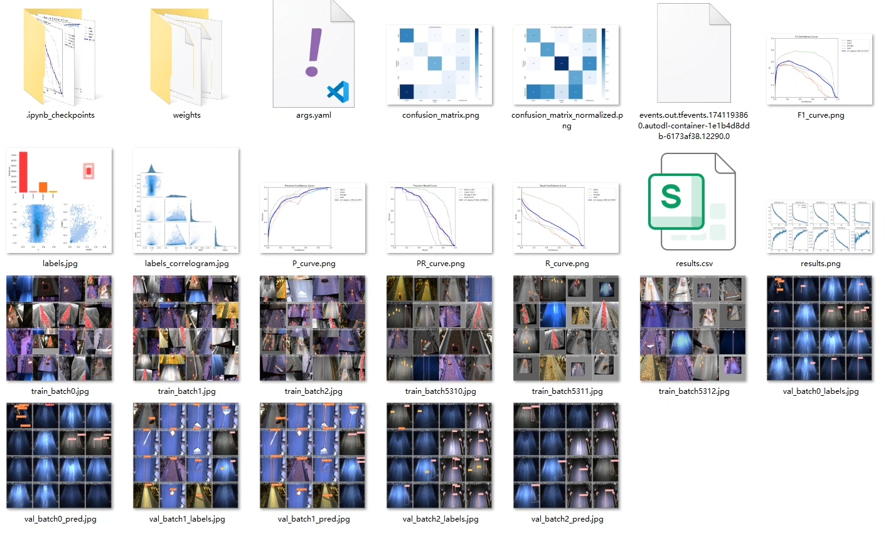
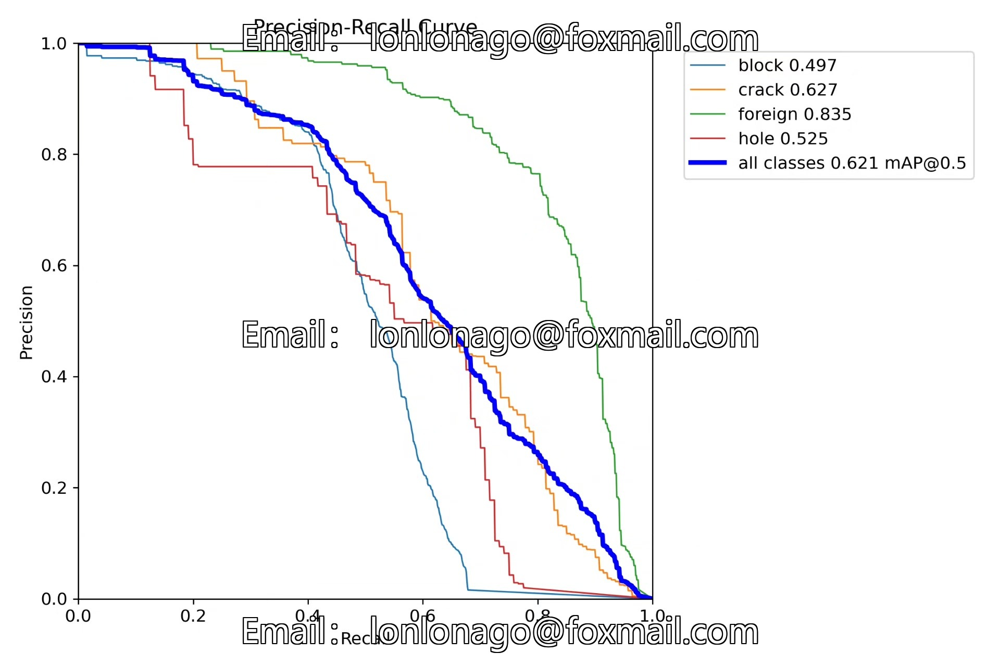
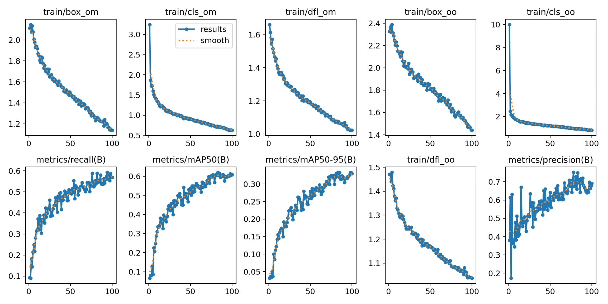
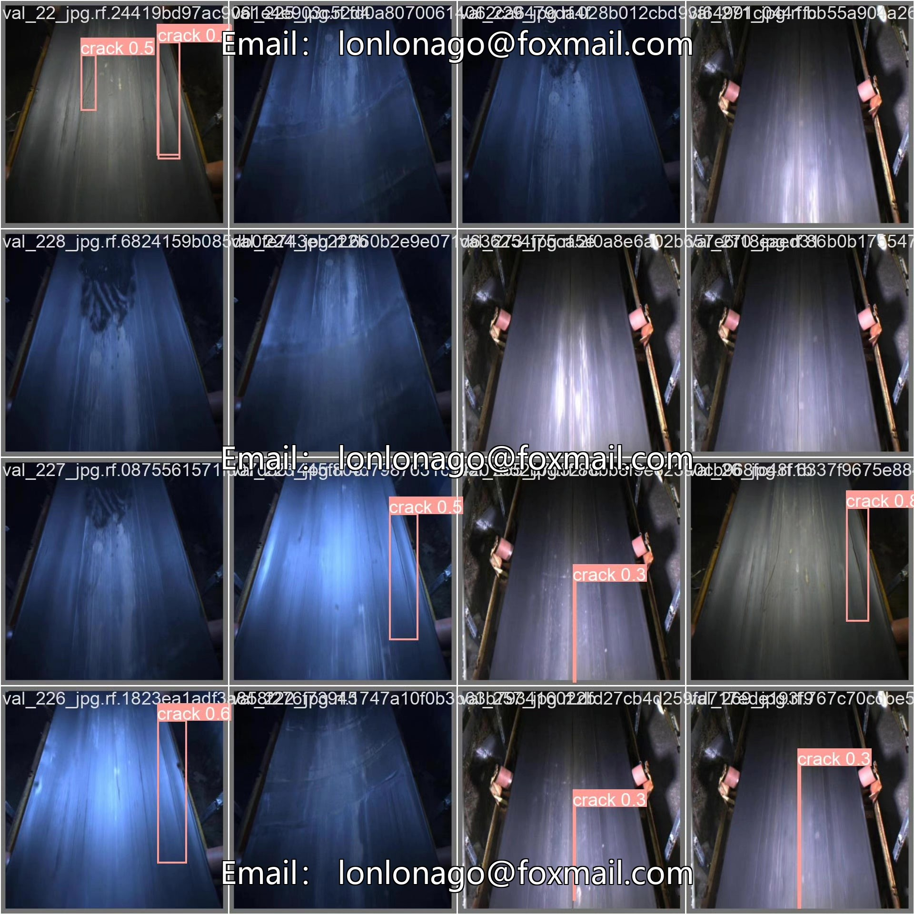
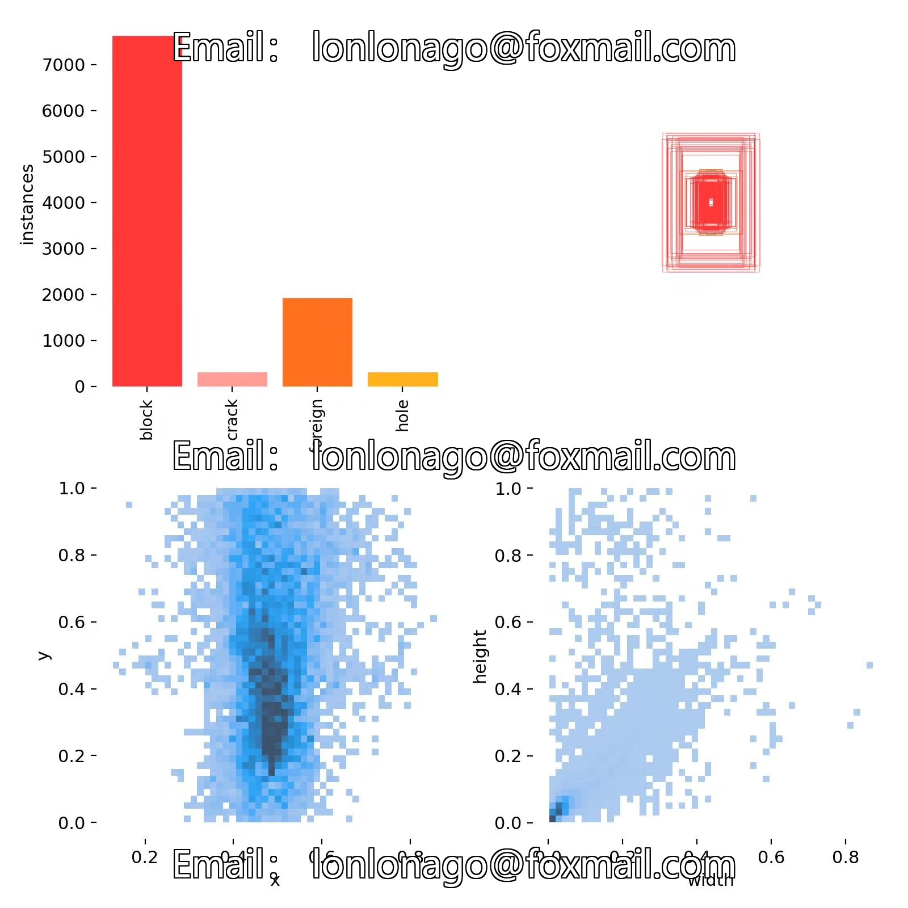
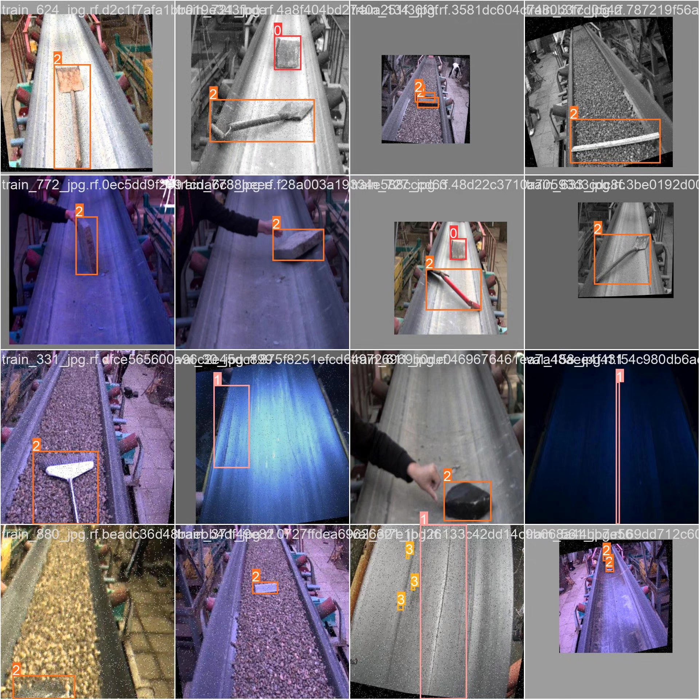

# Based on deep learning YOLOv10 for conveyor belt defect detection system (YOLOv1)

## Body

Based on deep learning YOLOv10, a conveyor belt defect detection system (YOLOv10+YOLO dataset + UI interface + Python project source code + model)

Deep learning target detection technology (such as the YOLO series) has made significant progress in the field of industrial inspection. YOLOv10, as the latest version of the YOLO series, offers higher detection speed and accuracy, making it very suitable for application scenarios such as conveyor belt defect detection. The purpose of this project is to utilize the YOLOv10 algorithm, combined with surface image data of conveyor belts, to develop an efficient and accurate defect detection system, providing intelligent support for quality control in industrial production.

The company's products have obtained the official commercial license certification from YOLO.

Package after-sales service: After payment, we will provide WeChat ID for any questions, free of charge.

Environment configuration: A tutorial on environment configuration will be provided, and WeChat will answer questions.

Remote installation service: If you need remote configuration, an additional fee of 69 is required, and all fees will be refunded if the configuration fails (only the installation fee is refundable for older computers).

Retraining dataset: After setting up the environment, you can train on your own computer. If you need us to retrain, just pay 69 plus computing power fees (2.5 yuan/hour).

Full after-sales service

## Images

## Payment

Here is a pay link on Stripe ( https://buy.stripe.com/3cs8yP7sY87d0vu9AB ). Please contact me lonlonago@foxmail.com after funding $89, and I will send you a complete data files , thank you!

